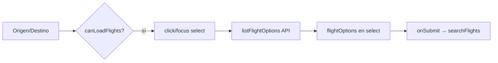

# System Patterns

## Capas

```
views/        → Orquestan búsqueda y estado de página
components/   → UI pura + eventos (@search, favoritos)
services/     → fetch API, LocalStorage (sin dependencias Vue)
router/       → Rutas y títulos de documento
```

## Flujo del formulario de búsqueda



- `onRouteChange`: limpia vuelo seleccionado y caché de opciones.
- `lastOptionsKey`: evita peticiones duplicadas si los filtros no cambian.

## Convenciones de código

- Servicios **no** importan `.vue`.
- Errores de API se propagan como `Error` con mensaje legible.
- Códigos IATA en mayúsculas al enviar a la API.
- Evento global `favorites-updated` para refrescar contador en navbar.

## Componentes clave

| Componente | Responsabilidad |
|------------|-----------------|
| `FlightSearchForm` | Filtros + dropdown + emit `search` |
| `FlightCard` | Tarjeta, favorito, link detalle + sessionStorage |
| `HomeView` | Estado loading/error/resultados |
| `FavoritesView` | Lista desde LocalStorage |
| `FlightDetailView` | Detalle desde sessionStorage o favoritos |

## Persistencia cliente

| Clave | Uso |
|-------|-----|
| `rastreador_vuelos_favoritos` | Array JSON en LocalStorage |
| `flight:{flightKey}` | Objeto vuelo en sessionStorage para detalle |

## Sin estado global

No se usa Pinia/Vuex; estado local en vistas y `reactive`/`ref` en formulario.
