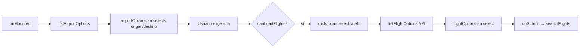

# System Patterns

## Capas

```
views/        → Orquestan búsqueda y estado de página
components/   → UI pura + eventos (@search, favoritos, mapa)
services/     → fetch API, LocalStorage (sin dependencias Vue)
router/       → Rutas y títulos de documento
```

## Layout principal (Home)

```
┌─────────────────────────────────────────────┐
│ Header: Rastreador de vuelos | Buscar Guardados │
├──────────────┬──────────────────────────────┤
│ Sidebar      │ Panel resultados (gris)      │
│ sketch-panel │  ┌─ flight-card (navy) ─┐   │
│  Origen|Dest │  │ Detalles    Guardar  │   │
│  N° vuelo    │  └──────────────────────┘   │
│  Estado      │  (tarjetas apiladas)         │
└──────────────┴──────────────────────────────┘
```

## Estilos (sketch theme)

| Token CSS | Uso |
|-----------|-----|
| `--sketch-bg` | Fondo general (#1c2236) |
| `--sketch-header` | Barra superior |
| `--sketch-panel` | Contenedores sidebar/resultados |
| `--sketch-card` | Tarjetas de vuelo |
| `--sketch-link` | Acción «Detalles» |
| `--sketch-accent` | Acción «Guardar» |

Clases reutilizables: `sketch-panel`, `sketch-form`, `flight-card`, `search-layout`.

## Flujo del formulario de búsqueda



- `listAirportOptions`: una petición a `/airports` por sesión (`airportOptionsCache`).
- `onRouteChange`: limpia vuelo seleccionado y caché de opciones de vuelos.
- `lastOptionsKey`: evita peticiones duplicadas si los filtros no cambian.

## Convenciones de código

- Servicios **no** importan `.vue`.
- Errores de API se propagan como `Error` con mensaje legible.
- Códigos IATA en mayúsculas al enviar a la API.
- Evento global `favorites-updated` para refrescar contador en navbar.

## Componentes clave

| Componente | Responsabilidad |
|------------|-----------------|
| `FlightSearchForm` | Filtros verticales en sidebar + emit `search` |
| `FlightCard` | Tarjeta oscura; Detalles / Guardar |
| `HomeView` | Layout sidebar (form) + panel resultados |
| `FavoritesView` | Lista desde LocalStorage |
| `FlightDetailView` | Detalle desde sessionStorage o favoritos, carga coordenadas de aeropuertos |
| `FlightMap` | Mapa Leaflet con ruta, marcadores de aeropuertos, popup salida, posición en vivo |

## Persistencia cliente

| Clave | Uso |
|-------|-----|
| `rastreador_vuelos_favoritos` | Array JSON en LocalStorage |
| `flight:{flightKey}` | Objeto vuelo en sessionStorage para detalle |

## Sin estado global

No se usa Pinia/Vuex; estado local en vistas y `reactive`/`ref` en formulario.
